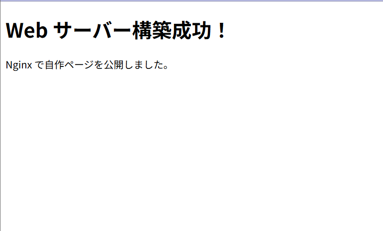

# サーバ構築手順書

## 1. 概要
本手順書では、初期状態からUbuntu上にサーバーを構築し、  
発展要素として **△△ を追加**したサーバ環境を再現可能な手順としてまとめる。

---

## 2. 前提条件

### 2.1 使用環境
- クライアントOS：Windows（WSL2 上の Ubuntu）
- サーバOS：Ubuntu 22.04 LTS
- 実行環境：WSL2 / 学内クラウド / VirtualBox（どれを使用したか明記）

### 2.2 使用ポート
- 22 / SSH
- 80 / HTTP
- 443 / HTTPS（必要な場合）
- その他（アプリや DB を利用する場合）

---

## 3. 全体構成図（任意・推奨）

※ `images/architecture.png` をここに貼

## 4. 初期設定手順

### 4.1　Ubuntuのインストール

1. PowerShell(管理者)を開き以下のコマンドを実行し、WSLとUbuntuをインストールする
- wsl --install
2. Ubuntuの初期設定を行う
- Windows再起動後Ubuntuが自動で起動するため任意のユーザー名とパスワードを入力する
3. Ubuntuのターミナルで以下のコマンドを実行し、Ubuntuを最新版に更新する
- sudo apt update && sudo apt upgrate -y
4. VSCodeを開き拡張機能"Remote Development"をンストールする
- "WSL"、"Dev Container"も自動でインストールされる
5. Ubuntuを再起動し以下のコマンドを実行してWindows側のVSCodeをUbuntuと連携する
- code .

### 4.2 新規ユーザー作成
- 以下のコマンドを実行する
sudo adduser <username>
sudo usermod -aG sudo <username>

### 4.3 SSH公開鍵設定
1. 以下のコマンドで鍵ペアを作成する（2025年現在最も推奨されているEd25519を使用）
- ssh-keygen -t ed25519
2. 以下のコマンドでサーバーに公開鍵を転送・登録する
- ssh-copy-id -i ~/.ssh/id_ed25519.pub username@192.168.1.10
3. 以下のコマンドで設定ファイルを開く
- sudo vim /etc/ssh/sshd_config
4. 挿入モードで設定ファイルを以下のように編集しパスワード認証を無効化する
- PasswordAuthentication no
5. SSHサービスを再起動する

### 4.4 ファイアウォール設定
1. ファイアウォールをインストールする
- sudo apt update
- sudo apt install ufw
2. 以下のコマンドで設定を行う
- デフォルトを拒否に設定
  sudo ufw default deny incoming
- SSH接続を許可
  sudo ufw allow ssh
- Webアクセスを許可
  sudo ufw allow http
  sudo ufw allow https
- 有効化
  sudo ufw enable
- 確認
  sudo ufw status verbose 

## 5. 発展要素　Nginx
### 5.1 Nginxとは？
Nginx（エンジンエックス）は、高速で軽量なオープンソースのWebサーバーであり、静的コンテンツをメインに大規模な処理や並列処理を得意とする。
本手順書では、このNginxを用いてWebサーバー環境を構築する。

### 5.2 Nginxによる静的サイト運営
1. 以下のコマンドでNignxをインストールする
- sudo apt install nginx
2. 以下のコマンドで/var/www/htmlに移動
- cd /var/www/html
3. 新しいindex.htmlを作成
- sudo nano index.html
4. エディタが開くので以下の内容を書き込み保存

```html
<!DOCTYPE html>
<html>
<head>
    <meta charset="UTF-8">
    <title>My Test Page</title>
</head>
<body>
    <h1>Web サーバー構築成功！</h1>
    <p>Nginx で自作ページを公開しました。</p>
</body>
</html>

5. Nginxを再起動する
sudo systemctl restart nginx
6. ブラウザで以下を入力する
http://localhost/
7. 動作確認
以下のような画面が表示されることを確認する



